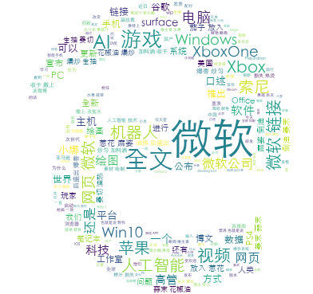

# 微博爬虫与词云展示

### 环境

- Python 3
- requests
- jieba
- matplotlib
- wordcloud
- scipy

### 爬虫

由于移动端网页版并未对爬虫做太大的限制，因此可以直接爬取微博搜索部分数据。搜索 API 如下：

```
https://m.weibo.cn/api/container/getIndex?type=wb&queryVal={}&containerid=100103type=2%26q%3D{}&page={}
```

基于这个 API 可以获取到一定量的 JSON 数据 （原始数据见 sample.json），经过处理后，格式如下:

```json
{
    "mid": "4199434918992223",
    "text": "【深度学习的终极形态】近期，院友袁进辉博士回到微软亚洲研究院做了题为《打造最强深度学习引擎》的报告，分享了深度学习框架方面的技术进展。他在报告中启发大家思考如何才能“鱼和熊掌兼得”，让软件发挥灵活性，硬件发挥高效率。我们整理了本次报告的重点，希望能对大家有所帮助！  ​...全文",
    "userid": "1286528122",
    "username": "微软亚洲研究院",
    "reposts_count": 21,
    "comments_count": 1,
    "attitudes_count": 9
}
```

详细的爬虫见 weibo_search.py。

### 词云

词云的实现可以使用 wordcloud，基本的步骤是：

1. 分词与关键词提取：中文的文本需要分词和去除大量的停用此，例如（你，我，他，这是），
才能使得生成的词云图更加具有意义。这一步，使用 jieba 分词起的 TF-IDF 关键词提取，就可以直接完成。

2. 传入 wordcloud 的是一个字符串以及一幅底层图像，将第一步得到的关键词用空格串联起来，
对于底层图像的选取，尽量选择白底无背景图像，这样生成的图像就会更加接近原图。

代码详见 weibo_cloud.py。


### 样例

关键词：iPhone


关键词：微软



关键词：谷歌

